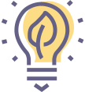
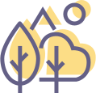

      <h3 class="section-intro"></h3>
      

        

          <h3 class="section-heading">let us remind you to :</h3>
          
respect the nature on site. respect the ground. respect the trees, some are very old. respect the water area (the small lake, the waterways …).

        

        

          <h3 class="section-heading">AND, plEASE :</h3>
          
do not print your ticket, download it &amp; use your phone do not pee on the land, use the provided toilets. do not litter on the land, use the provided bins for general waste and for composting/swill. do not throw your cigarettes butts on the ground, use the provided cigarette butts’ collection facilities or ashtrays.

        

      

      

    

  

  

    

      

        

          <h3 class="section-intro nomargin">green energy</h3>
          
We are powered up with renewable energy. Green power will lower the impact of lighting &amp; music.  In 2017, all our generators were using bio fuel and their capacity was reduced from 800 to 420 kVA since our first year. Furthermore, our camping area was 100 % powered on solar energy for 2 years in a row and we use 95% of low consumption lightning on site.

        

        

      

      

        

        

          <h3 class="section-intro nomargin">future food</h3>
          
We ask our food provider to use 100 % locally sourced &amp; organically grown food and ingredients from fair-trade source.  Because of meat’s high climate &amp; environmental impact, we propose a large range of vegetarian &amp; meat free food supply. Menus are discussed internally in order to offer large &amp; balanced alternatives. And we try to adapt food quantity to avoid leftovers.

        

      

      

        

          <h3 class="section-intro nomargin">waste management</h3>
          
Waste is sorted and recycled with the help of our waste manager and our waste collection company. This year, we are aiming to find a compost solution to improve our waste stream.  We have a limited waste flow (no paper flyers, no receipts, use of eco cups, free portable ashtrays etc.), In 2017, we succeeded in reducing our waste up to 35%, part of which 40% was recycled waste (PVC, glass and used oil).  We ask our food trucks to use only compostable silverware. And, if any, we collect the food surplus to be distributed to people in need.

        

        

      

      

        

        

          <h3 class="section-intro nomargin">transport</h3>
          
The lower the carbon footprint of the used transport mode, the closer one can park to the festival. So how will you get here?  By providing near entrance parking for sustainable transport modes with our bicycle point we intend to lower the biggest festival impact. We promote Carpooling and Public transports on our web site and with partnerships. You nevertheless come by car, then know that our car parking ticket is reduced by half if you are more than 2 persons in a car.

        

      

      

        

          <h3 class="section-intro nomargin">filtered tap water</h3>
          
A wave of plastic water bottles usually submerges festivals, we propose a less lucrative but more responsible alternative: meet Paradise City still &amp; sparkling Tap Water.  Moreover we will have a mobile wastewater treatment unit filtering the water to good quality. Check out all the info here!

        

        

      

      

        

        

          <h3 class="section-intro nomargin">eco-toilets</h3>
          
We are reducing excessive water use &amp; treatment as much as possible.

        

      

      

        

          <h3 class="section-intro nomargin">awareness</h3>
          
Our sustainable vision is communicated to each partner &amp; sponsor to assure they share our concerns about a greener future. And we give you useful sustainable tips on the festival site.  Just as last year, Beplanet (http://beplanet.org) will be on site to present new innovative and sustainable projects on site. Furthermore, this year, we will ask our guests to participate to a good cause and financially support the Klimaatzaak / le Projet Climat (https://www.klimaatzaak.eu/nl; https://affaire-climat.be)

        

        

      
